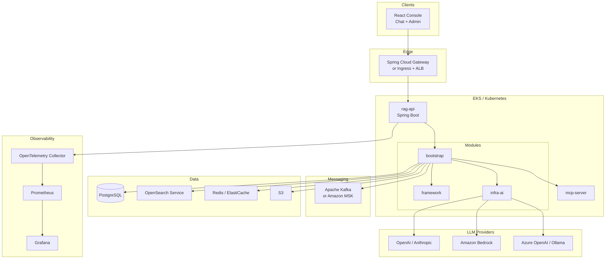

# AI RAG Engine - Enterprise Cloud-Native Platform 

**AI RAG Engine** is an enterprise-grade **agentic AI platform** built with **Java 21** and **TypeScript**. It covers the full lifecycle from **document ingestion** and **multi-channel retrieval** to **LLM orchestration**, **intent routing**, and **MCP tool execution**. 

This repository is a **structured refactor** of the [nageoffer/ragent](https://github.com/nageoffer/ragent) architecture: same domain capabilities and extension points, reimplemented with
 **cloud-native** building blocks—no regional middleware or vendor lock-in to domestic stacks.


--- 

## Table of Contents 

- [Overview](#overview)
- [Build Strategy](#build-strategy)
- [Phased Roadmap](#phased-roadmap)
- [Key Features](#key-features)
- [Architecture](#architecture)
- [Tech Stack](#tech-stack)
- [Engineering Practices](#engineering-practices)
- [Deployment](#deployment)
- [Quick Start](#quick-start)
- [Extension Points](#extension-points)
- [Comparison](#comparison)
- [Contributing](#contributing)
- [License](#license)
- [Acknowledgments](#acknowledgments)

--- 

## Overview 
Production RAG is not "embed + search + chat." Real systems need **ingestion pipelines**, **hybrid retrieval**, **query rewriting**, **intent trees**, **session memory**, **model failover**, **rate limiting**, **distributed tracing**, and **operator-facing consoles**. 

AI RAG Engine targets that bar: 

| Capability | Summary |
|------------|---------|
| **Ingestion** | Pluggable pipeline: parse → chunk → embed → index, with per-node audit logs |
| **Retrieval** | Parallel semantic + keyword + intent-directed channels; dedup and rerank post-processing |
| **Agentic layer** | Tree-shaped intent classification, clarification when confidence is low |
| **Model plane** | Multi-provider routing, first-token probe, three-state circuit breaker, graceful degradation |
| **Tools** | [Model Context Protocol (MCP)](https://modelcontextprotocol.io/) for non-KB intents |
| **Operations** | Admin UI, RAG trace visualization, knowledge scheduling, user/rate limits |

**Languages & scale (reference baseline from upstream design):** ~40k LOC Java, ~18k LOC TypeScript/React, 20+ domain tables, 22 UI surfaces.


--- 

## Build Strategy 

Development follows a **copy-and-refactor** approach: 

1. **Preserve behavior** -- Keep request flows, extension interfaces, and domain boundaries aligned with the proven Ragent design (`framework` / `infra-ai` / `bootstrap` / `mcp-server` / `frontend`). 

2. **Replace infrastructure** -- Swap messaging, auth, context propagation, and observability for **Kafka**, **Spring Cloud**, **OpenTemelemtry**, **OAuth2**, and **AWS-managed services** where appropriate. 

3. **Prove with tests** -- Red-green **TDD** for core logic; **BDD** scenarios for user-visible RAG paths; gates in **Jenkins** and Git-based pipelines. 

4. **Ship cloud-native** -- Container images, Helm charts, EKS deployment, HPA, and full observability from day one of the integraiton phase. 


--- 

## Phased Roadmap 

### Phase 1 -- Exploration / Open Source 

Run locally with portable OSS components:

- PostgreSQL (+ `pgvector`) for relational + vector data
- Redis for caching, sessions, distributed rate limiting
- Kafka for async ingestion and domain events
- Object storage via S3-compatible API (MinIO locally)
- OpenSearch or pgvector for vector search experiments
- OpenTelemetry → Jaeger or OTLP collector; Prometheus + Grafana

### Phase 2 — Cloud Integration (AWS)

Progressive replacement with managed services:

| Open-source / local | AWS target |
|---------------------|------------|
| MinIO / local files | **Amazon S3** |
| PostgreSQL (selected domains) | **DynamoDB** (where access patterns fit) |
| OpenSearch / pgvector | **Amazon OpenSearch Service** |
| Kafka (managed path) | **Amazon MSK** or **SQS** + workers |
| Self-hosted K8s | **Amazon EKS** |
| Metrics/logs | **CloudWatch** + existing Prometheus/Grafana |
| CI artifacts | **ECR**, optional **CodePipeline** |

Goals: **auto-scaling**, **multi-AZ resilience**, **secrets via IAM/IRSA**, and **enterprise observability** (traces, metrics, structured logs).


--- 

## Key Features 

- **Document ingestion & indexing** -- Orchestrated pipeline; conditional nodes; failure isolation per stage. 

- **Multi-source retrieval** -- Channel strategy pattern; parallel execution; ordered post-processor chain. 

- **Agentic orchestration** -- Intent tree, query rewrite/decompositon, hybrid term mapping. 

- **Model resilience** -- Priority routing, streaming frist-packet probe, per-model circuit breaker. 

- **Distributed limits** -- Redis-backed queue + semaphore pattern; SSE queue position for clients. 

- **Conversation memory** -- Sliding window + summarization; bounded token growth. 

- **Security** -- OAuth2 / OIDC (e.g., Keyclock locally, Cognito on AWS); role-based admin APIs. 

- **Cloud-antive ready** -- 12-factor services, health/readiness probes, graceful shutdown, config externalization via Spring Cloud Config. 

- **Extensible** -- New channels, post-processors, ingestion nodes, LLM providers, and MCP tools via interface + Spring registraiton-no core fork required. 


---

## Architecture 

### High-level deployment (target)



### Maven modules

| Module | Responsibility |
|--------|----------------|
| `framework` | Cross-cutting: exceptions, idempotency, IDs, SSE, **OpenTelemetry** trace + baggage propagation, Kafka templates |
| `infra-ai` | `ChatClient`, embedding, rerank, routing, health store / circuit breaker |
| `bootstrap` | RAG, knowledge base, ingestion, users, admin APIs |
| `mcp-server` | Standalone MCP tool host |
| `frontend` | React + TypeScript SPA |

### Core request path (simplified)

```
User query
  → AuthN / rate limit
  → Intent classification (tree)
  → [Optional] rewrite / decompose / clarify
  → Parallel search channels
  → Post-processors (dedup → rerank → …)
  → Prompt assembly (StringTemplate)
  → Routed LLM stream (SSE) + first-packet probe
  → [Optional] MCP tool execution
  → Persist message + RAG trace
```

--- 

## Tech Stack 


